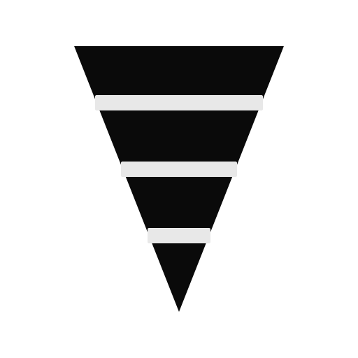

<p align="center">
  
</p>

# Kimberlite

[](https://crates.io/crates/kimberlite)
[](https://crates.io/crates/kimberlite)
[](https://docs.rs/kimberlite)
[](https://www.rust-lang.org)
[](https://doc.rust-lang.org/edition-guide/)
[](LICENSE)
[](https://github.com/kimberlitedb/kimberlite/actions/workflows/ci.yml)
[](docs/TESTING.md)
[](docs/concepts/formal-verification.md)
[](https://discord.gg/QPChWYjD)

**The world's first database with complete 6-layer formal verification.**

🎯 **136+ machine-checked proofs** guarantee correctness from protocol specifications to code implementation.

🔬 **Developer Preview** - Explore deterministic database concepts through production-quality code

Kimberlite is a verifiable, durable database engine designed for environments where data integrity, auditability, and trust are non-negotiable. Built around a single principle:

> **All data is an immutable, ordered log. All state is a derived view.**

## World's First Formally Verified Database

Kimberlite is the **most formally verified database system ever built**, with 136+ machine-checked proofs across 6 verification layers:

| Layer | Tool | Proofs | What's Verified |
|-------|------|--------|-----------------|
| **Protocol** | TLA+, Ivy, Alloy | 30 | Agreement, view changes, recovery, Byzantine tolerance |
| **Cryptography** | Coq | 15+ | SHA-256, BLAKE3, AES-GCM, Ed25519, key hierarchy |
| **Code** | Kani | 91 | Offset monotonicity, isolation, hash chains, corruption detection |
| **Types** | Flux | 80+ | Compile-time safety properties (ready when Flux stabilizes) |
| **Compliance** | TLA+ | 6 frameworks | HIPAA, GDPR, SOC 2, PCI DSS, ISO 27001, FedRAMP |
| **Integration** | Custom | 19 traces | 100% TLA+ → Rust → VOPR traceability |

**Why this matters:** Traditional databases rely on testing, which can't prove absence of bugs. Kimberlite uses mathematical proofs to guarantee correctness—the same techniques used for space missions and medical devices.

**→ [Read the full formal verification guide](docs/concepts/formal-verification.md)**

## Who Should Explore This

- 🔬 **Database researchers** - Study immutable log architectures and deterministic consensus
- 💻 **Systems programmers** - Learn FCIS pattern, deterministic design, and advanced testing
- 🏛️ **Compliance architects** - Explore audit-first database concepts for regulated industries

**Perfect for learning.** Not yet recommended for production deployments (see [Status](#status) below).

## Quick Start

**5-minute quickstart:** See [START.md](START.md) for a complete tutorial with explanations.

**TL;DR:**

```bash
# Clone and build
git clone https://github.com/kimberlitedb/kimberlite.git
cd kimberlite
cargo build --release

# Initialize, start, and query
./target/release/kimberlite init ./data --development
./target/release/kimberlite start --address 127.0.0.1:3000 ./data
./target/release/kimberlite repl --address 127.0.0.1:3000
```

Try time-travel queries:
```sql
CREATE TABLE patients (id INTEGER, name TEXT);
INSERT INTO patients VALUES (1, 'Alice'), (2, 'Bob');

-- View current state
SELECT * FROM patients;

-- View state 10 seconds ago
SELECT * FROM patients AS OF TIMESTAMP '2026-02-03 10:30:00';
```

## Documentation

- [Quick Start](https://kimberlite.dev/docs/quick-start) - Get running in 90 seconds
- [CLI Reference](https://kimberlite.dev/docs/reference/cli) - All commands
- [SQL Reference](https://kimberlite.dev/docs/reference/sql) - Supported SQL syntax
- [Architecture](https://kimberlite.dev/architecture) - How Kimberlite works
- [Roadmap](ROADMAP.md) - Future features and enhancements
- [Changelog](CHANGELOG.md) - Release history and completed work
- [Contributing](CONTRIBUTING.md) - How to contribute

## Building from Source

```bash
# Clone and build
git clone https://github.com/kimberlitedb/kimberlite.git
cd kimberlite
cargo build --release -p kimberlite-cli

# Binary is at ./target/release/kimberlite
```

### Development Commands

```bash
just build          # Debug build
just build-release  # Release build
just test           # Run all tests
just nextest        # Faster test runner
just clippy         # Linting
just pre-commit     # Run before committing
```

## Key Features

**What Makes Kimberlite Unique:**

- ✅ **Immutable audit trail** - Hash-chained append-only log (SHA-256 for compliance, BLAKE3 for performance)
- ✅ **Time-travel queries** - MVCC enables `AS OF TIMESTAMP` queries without separate audit tables
- ✅ **Deterministic core** - Functional Core / Imperative Shell pattern enables perfect replication
- ✅ **Multi-tenant isolation** - Per-tenant storage with cryptographic boundaries
- ✅ **SQL interface** - Standard DDL/DML with compliance extensions (audit views, retention policies)
- ✅ **Tamper-evidence** - CRC32 checksums + hash chains detect corruption
- 🚧 **Viewstamped Replication (VSR)** - Consensus protocol for multi-node deployments (in progress)

**Legend**: ✅ Production-ready | 🚧 Experimental

## Use Cases

Kimberlite is designed for:
- Healthcare (EHR, clinical data, HIPAA)
- Financial services (audit trails, transaction records)
- Legal systems (chain of custody, evidence)
- Government (regulated records, compliance)

## Examples

See the [examples/](examples/) directory for:
- [quickstart/](examples/quickstart/) - Getting started
- [rust/](examples/rust/) - Rust SDK examples
- [docker/](examples/docker/) - Docker deployments
- [healthcare/](examples/healthcare/) - HIPAA-ready schema

## Architecture

```
┌──────────────────────────────────────────────────┐
│  Kernel (pure state machine: Cmd -> State + FX)  │
├──────────────────────────────────────────────────┤
│  Append-Only Log (hash-chained, CRC32)           │
├──────────────────────────────────────────────────┤
│  Crypto (SHA-256, BLAKE3, AES-256-GCM, Ed25519)  │
└──────────────────────────────────────────────────┘
```

See [docs/ARCHITECTURE.md](docs/ARCHITECTURE.md) for details.

## Why Kimberlite vs. Traditional Databases?

| Feature | PostgreSQL | Kimberlite |
|---------|-----------|-----------|
| **Data model** | Mutable tables | Immutable log + derived views |
| **Audit trail** | Manual triggers | Built-in (every write logged) |
| **Time-travel** | Extensions (complex) | Native SQL (`AS OF TIMESTAMP`) |
| **Integrity** | Checksums | Hash chains + CRC32 |
| **Consensus** | Streaming replication | VSR (deterministic) |
| **Best for** | General OLTP | Compliance-heavy workloads |

**Trade-offs:** Kimberlite sacrifices 10-50% write performance for built-in auditability and tamper-evidence. See [FAQ.md](FAQ.md) for detailed comparisons.

## Learning Resources

### Pressurecraft: Teaching-First Codebase

Kimberlite is built with a **Pressurecraft** philosophy - code designed to teach, not just work.

**What you'll learn:**
- Pure vs. impure functions (FCIS pattern)
- Command/Effect pattern for determinism
- Why determinism enables replication
- Assertion-driven development (2+ assertions per function)

**Start here:**
```bash
cd pressurecraft
cargo test          # Run all tests
cargo run --example counter        # Simplest example
cargo run --example mini_database  # Complete system
```

See [pressurecraft/README.md](pressurecraft/README.md) for the full learning path.

### Documentation Deep Dive

- [docs/ARCHITECTURE.md](docs/ARCHITECTURE.md) - FCIS pattern, kernel design, consensus
- [docs/ASSERTIONS.md](docs/ASSERTIONS.md) - Why we promote 38 assertions to production
- [docs/TESTING.md](docs/TESTING.md) - VOPR deterministic simulation testing
- [docs/PRESSURECRAFT.md](docs/PRESSURECRAFT.md) - Code quality standards
- [docs/COMPLIANCE.md](docs/COMPLIANCE.md) - HIPAA, SOC 2, GDPR guidance

## Community

- 💬 [Discord](https://discord.gg/QPChWYjD) - Join for real-time support, design discussions, and community
- 📖 [Documentation](docs/) - Comprehensive architecture and usage guides
- 🐛 [Issues](https://github.com/kimberlitedb/kimberlite/issues) - Bug reports and feature requests
- 💡 [Discussions](https://github.com/kimberlitedb/kimberlite/discussions) - Questions, ideas, and design conversations
- ❓ [FAQ](FAQ.md) - Frequently asked questions

## Status

> **v0.4.0 Developer Preview** - Focused on learning and exploration.
>
> - ✅ **Core is solid:** 1,300+ tests, deterministic simulation, production-grade crypto
> - ✅ **Architecture is stable:** FCIS pattern, immutable log, VSR consensus
> - ⚠️ **APIs are evolving:** v0.x means breaking changes possible (SemVer compliant)
> - ⚠️ **Limited production use:** Not yet battle-tested at scale
>
> **Use for:** Internal tools, prototypes, learning database internals, compliance research
>
> **Wait for v1.0 (Q2 2027) if you need:** API stability guarantees, large-scale production, commercial support

## SDKs

Kimberlite provides idiomatic client libraries for multiple languages:

| Language   | Status | Package | Install |
|------------|--------|---------|---------|
| Rust       | ✅ Ready | `kimberlite` | `cargo add kimberlite` |
| Python     | 🚧 In Progress | `kimberlite` | `pip install kimberlite` |
| TypeScript | 🚧 In Progress | `@kimberlite/client` | `npm install @kimberlite/client` |
| Go         | 📋 Planned | `github.com/kimberlitedb/kimberlite-go` | `go get ...` |
| Java       | 📋 Planned | `com.kimberlite:kimberlite-client` | Maven/Gradle |
| C#         | 📋 Planned | `Kimberlite.Client` | `dotnet add package ...` |
| C++        | 📋 Planned | `kimberlite-cpp` | Coming soon |

See [docs/SDK.md](docs/SDK.md) for architecture and [docs/PROTOCOL.md](docs/PROTOCOL.md) for wire protocol specification.

## License

Apache 2.0

## Contributing

- Read [CLAUDE.md](CLAUDE.md) for development guidelines
- Review [docs/PRESSURECRAFT.md](docs/PRESSURECRAFT.md) for coding standards
- Open issues for design discussions
